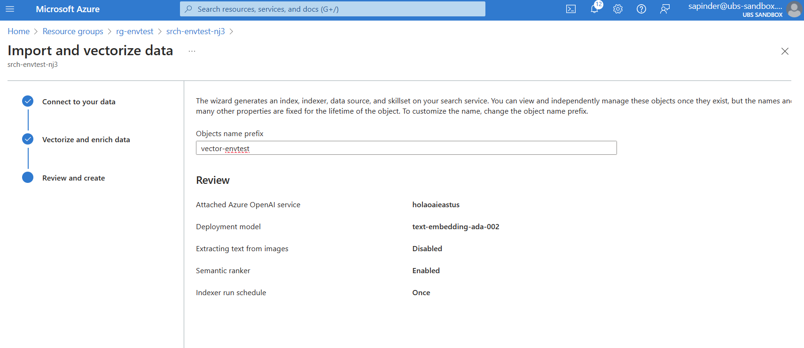

# AI Search Retrieval-augmented generation

Deploy an assistant that can search an Azure AI Search index to respond to questions.
This sample will consider a sample HR Handbook.

## Steps

- Go to the Storage Account created as part of the deployment and add a container `documents`.

- Drop any files you would like to be searched by the bot into the container. Supported file formats include. It is recommended to start with PDF, DOCX or PPTX. A great example to quickly validate the solution is to use sample [documents from here.](https://github.com/Azure-Samples/azure-search-openai-demo/tree/main/data)

- Go to your Azure AI Search resource and use the Import and Vectorize data feature. It will take care of the entire process of chunking, vectorizing and adding each document in the blob storage container to your search index.

- Back to App Services, add the relevant environment variables:
    - **SEARCH_INDEX**: The name of the search index created.
        
    - **SEARCH_SEMANTIC_CONFIG**: The name of the semantic configuration created. You can locate this value by going to Indexes -> Selec your index -> Semantic Configurations
        
        
- (Optional) To enable linked citations:
    - Go to the created Index and add a "path" field, with the Retrievable option enabled.
    - Go to the created Indexer's JSON definition and add a field mapping to the path field

            "fieldMappings": [
                {
                    "sourceFieldName": "metadata_storage_name",
                    "targetFieldName": "title",
                    "mappingFunction": null
                },
                {
                    "sourceFieldName": "metadata_storage_path",
                    "targetFieldName": "path",
                    "mappingFunction": null
                }
            ],

    - Go to the created Skillset and add a mapping to the "path" field

            "indexProjections": {
                "selectors": [
                {
                    "targetIndexName": "vector-1705514319324",
                    "parentKeyFieldName": "parent_id",
                    "sourceContext": "/document/pages/*",
                    "mappings": [
                    {
                        "name": "chunk",
                        "source": "/document/pages/*",
                        "sourceContext": null,
                        "inputs": []
                    },
                    {
                        "name": "vector",
                        "source": "/document/pages/*/vector",
                        "sourceContext": null,
                        "inputs": []
                    },
                    {
                        "name": "title",
                        "source": "/document/metadata_storage_name",
                        "sourceContext": null,
                        "inputs": []
                    },
                    {
                        "name": "path",
                        "source": "/document/path",
                        "sourceContext": null,
                        "inputs": []
                    }
                    ]
                }
                ],
                "parameters": {
                "projectionMode": "skipIndexingParentDocuments"
                }
            },
            ...

## Deployment validation

Ask the sample questions to verify that the deployment was successful:

## Customization steps

Once the sample is deployed, you will likely want to connect the assistant to your own document collection. To do this, follow the steps below:

- Add any other documents you would like added to the bot
- Re-run the indexing process to update the index
- Create a new plugin similar to [src/Plugins/HRHandbookPlugin.cs](../src/Plugins/HRHandbookPlugin.cs) with information about your document collection. This includes:
    1. The method descriptions should describe the type of information found on the document collection;
    2. Any additional information about the data that might help the model consume it;
    3. Optionally, add other pre-canned methods that might be more targeted to your documents, or use custom filters
- Add your plugin to [src/Bots/SemanticKernelBot.cs](../src/Bots/SemanticKernelBot.cs)
